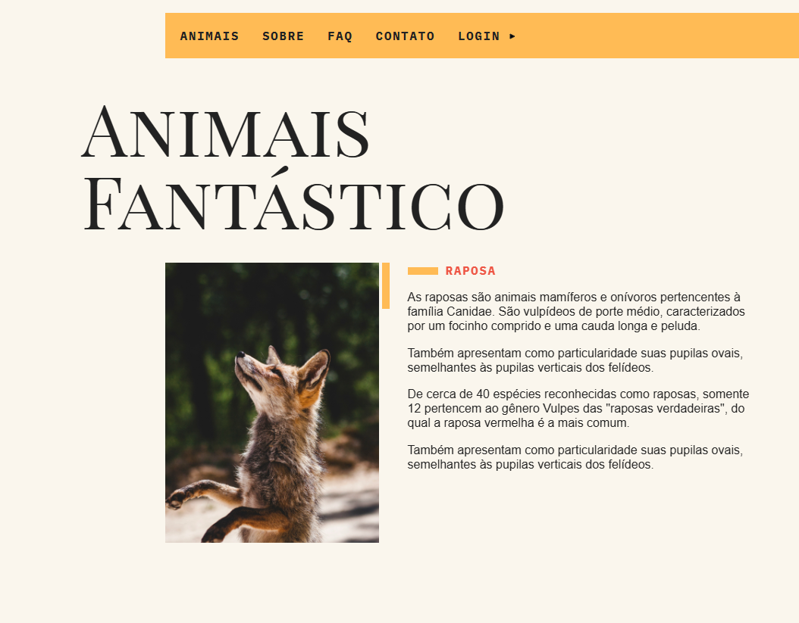
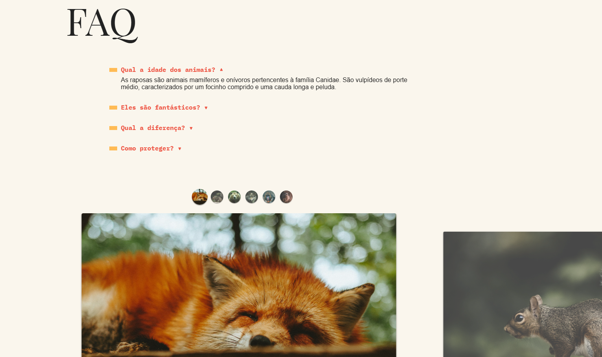

# 🦊 Animais Fantásticos — JavaScript Completo ES6+

> Aplicação web interativa construída do zero com JavaScript puro (Vanilla JS), explorando o máximo do JS moderno na manipulação do DOM e criação de componentes ricos e performáticos — sem dependência de frameworks.

🔗 **[Ver projeto ao vivo](https://animais-fantasticos-flax-six.vercel.app)** · **[Repositório](https://github.com/samuel-barengo/animais-fantasticos)**

---

## 📸 Preview




---

## 🛠️ Tecnologias e Ferramentas

| Categoria | Tecnologias |
|---|---|
| Core | JavaScript ES6+, HTML5, CSS3 |
| Build | Webpack 5, Babel, NPM |
| Qualidade | ESLint |
| Versionamento | Git, GitHub |

---

## ⚙️ Funcionalidades

### Componentes de Interface
- **Navegação por Tabs** — seleção de imagens com sincronização dinâmica de índices do DOM
- **Accordion (FAQ)** — sistema interativo com animações CSS para exibir/ocultar conteúdo
- **Scroll suave & animações** — `window.scrollTo` e `Element.getBoundingClientRect()` para disparar animações de entrada
- **Modal de Login** — controle de visibilidade com fechamento ao clicar fora do container
- **Tooltip avançada** — posicionamento dinâmico baseado no movimento do cursor sobre o mapa
- **Menu Mobile** — padrão hamburger com acessibilidade e fechamento via click outside
- **Slide/Carousel** — componente construído do zero com suporte a touch events (mobile) e mouse events (desktop)

### Integrações Assíncronas
- **Cotação do Bitcoin** — requisição HTTP via Fetch API com atualização em tempo real
- **Horário de funcionamento** — `new Date()` com funções assíncronas para validar dias/horários e alterar o status visualmente
- **Contador animado** — incremento dinâmico disparado via scroll, consumindo dados de JSON externo

---

## 🏗️ Arquitetura

O projeto passou por uma **refatoração completa** — de funções utilitárias isoladas para o padrão de **Classes ES6**:

```js
class Slide {
  constructor(container, elements) {
    this.container = document.querySelector(container);
    this.elements = document.querySelectorAll(elements);
    this.init();
  }
}

class SlideNav extends Slide {
  constructor(container, elements) {
    super(container, elements);
    this.addArrows();
  }
}
```

**Conceitos aplicados:**
- `constructor`, encapsulamento com `get` e `set`, herança com `extends`
- Gerenciamento de escopo do `this` com `.bind()` nos Event Listeners
- Prototype chain e herança de protótipos
- Call Stack, Task Queue e Event Loop

---

## 🚀 Como rodar localmente

```bash
git clone https://github.com/samuel-barengo/animais-fantasticos.git
cd animais-fantasticos
npm install
npm run dev
```

---

## 👨‍💻 Autor

**Samuel Barengo**  
Desenvolvedor Front-end | JavaScript · TypeScript · React · Bootstrap

[](https://linkedin.com/in/samuel-barengo-a44431241)
[](https://github.com/samuel-barengo)

docs: add README 
